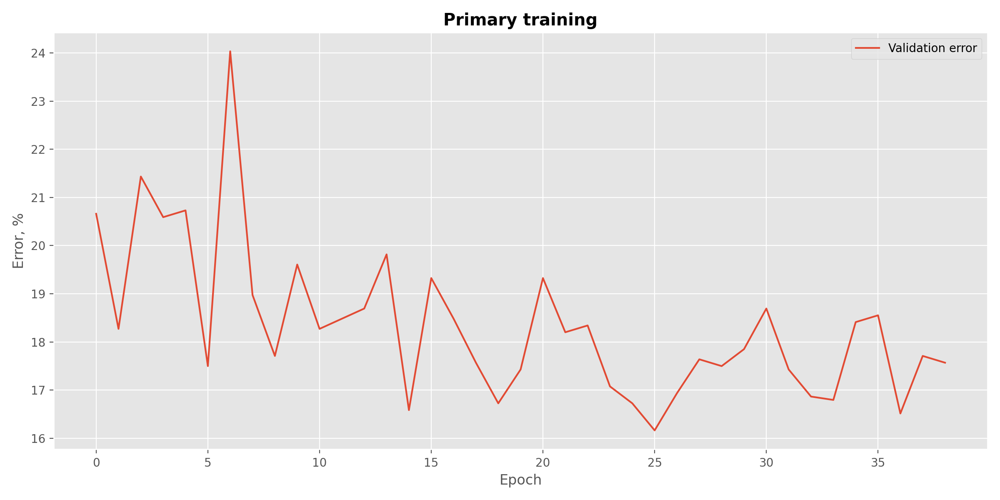
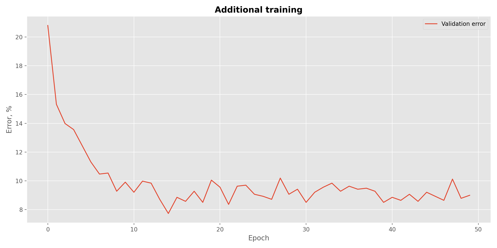

# Quick introduction

### Project structure

```bash
.
├── input 
│   ├── images                # custom dataset arranged in directories according to labels
│   │   ├── georges
│   │   └── non_georges       
│   └── ...                   # labels (georges.csv and non_georges.csv)                  
├── notebooks
├── output                    
│   ├── primary_train         # Model parameters and accuracy history after primary training
│   ├── additional_train      # Model parameters and accuracy history after additional training
│   └── ...                   # Generated figures
├── src                       # Source code files for training and results visualisation
├── requirements.txt
└── README.md
```

Despite best practices, model parameters are included in this repository to make everyone's lives easier.

### How to run

Run the following in you command line interpreter:

```bash
python main.py
```

No arguments are can be passed. Hyperparameters setting and minimal adjustments can be done by altering `global_vars.py`
in `src` directory. Some other adjustments can be done by altering `main.py` (for example, to alter **line 79** to define 
whether the model should load pre-trained parameters or start from ImageNet feature extractor).

Such decision is motivated by the desire to *keep it simple* for now and to speedup the development
process. This project only solves this particular task

### Dependencies

Only tested with **Python 3.9.x**. The full list of dependencies can be found in `requirements.txt`. This file contains 
exhaustive list of packages I use as a **general purpose environment**, so not all the present packages are actually 
used here.

# Results discussion

ResNet [[1]](https://arxiv.org/abs/1512.03385) is used to solve the binary classification task. In particular, 50 layers
variation is utilized. **The best validation accuracy at the moment of posting is 92.27%**. It, however, anticipated that
accuracy will achieve even better results with longer training and less aggressive learn rate reduction.

Training was performed in two stages:
- Primary training
- Additional training

**Primary training** was performed with ImageNet pre-trained parameters for feature extraction and new last fully 
connected layer with a single value output and sigmoid activation. Adam optimizer is used for this stage with learn rate 
decreased by 1e-1 after 10 epochs and by 1e-2 after 20 epochs. Feature extraction parameters are left as is. 
Hyperparameters are given in the table below.

| Hyperparameter         | Value |
|------------------------|-------|
| Starting Learn Rate    | 1e-2  |
| Minibatch Size         | 128   |
| Threshold              | 0.5   |



**Additional training** adjusts the whole network, including feature extraction part. Stochastic Gradient Descent is used 
here and hyperparameters are picked according to the original work on ResNet [[1]](https://arxiv.org/abs/1512.03385) (
see table below). Learn rate is decreased by 1e-1 after 5 epochs and by 1e-2 after 10 epochs. Small intervals are picked
due to the lack of compute at my disposal.

| Hyperparameter         | Value |
|------------------------|-------|
| Starting Learn Rate    | 1e-2  |
| Minibatch Size         | 128   |
| Threshold              | 0.5   |
| Momentum               | 0.9   |
| Weight Decay           | 1e-4  |




# Future work

- Add dropout to prevent overfitting
